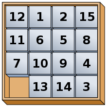

# ai_project1
<h3>15 Puzzle Solver Using A* Search</h3>

Uses an input file with an initial and desired puzzle state to solve a 15 puzzle.  

"The 15 puzzle (also called Gem Puzzle, Boss Puzzle, Game of Fifteen, Mystic Square and many others) is a sliding puzzle having 15 square tiles numbered 1–15 in a frame that is 4 tiles high and 4 tiles wide, leaving one unoccupied tile position. Tiles in the same row or column of the open position can be moved by sliding them horizontally or vertically, respectively. The goal of the puzzle is to place the tiles in numerical order" (<a href="https://en.wikipedia.org/wiki/15_puzzle">Wikipedia</a>). 

<h3>15 Puzzle Example</h3>
 

<h3>Output is of the form:</h3>
Depth of the solution 
Total number of nodes generated 
Actions in the solution path 
f(n) cost of the nodes in the solution path 

<h3>Sample Input</h3>
1 5 3 13 
8 0 6 4 
15 10 7 9 
11 14 2 12  

1 5 3 13 
0 7 6 4 
8 10 9 2 
11 15 14 12 

<h3>Sample Output</h3>
1 5 3 13 
8 0 6 4 
15 10 7 9 
11 14 2 12  

1 5 3 13 
0 7 6 4 
8 10 9 2 
11 15 14 12 

6 
244 
6 5 8 1 2 3 
6 11 15 18 20 21 21
